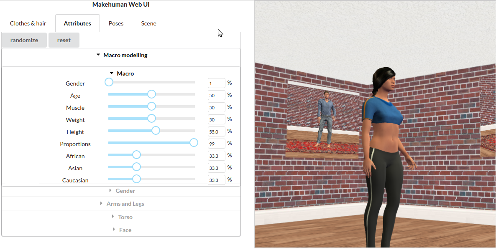

# makehuman-js

A library that builds human models in the browser.

A live demo (NSFW while loading) is available at [mhwebui.wassname.com](http://mhwebui.wassname.com/)

An an example of how to use this library is in the [example repository](https://github.com/makehuman-js/makehuman-js-example).

# Status

This is a alpha product.

# Usage

An example of how to use the library is available at [makehuman-js/makehuman-js-example](https://github.com/makehuman-js/makehuman-js-example).

# Tests

- clone
- `npm install`
- `npm test` (or on windows use `npm run test_windows`)
- this will launch a browser which will run mocha unit tests

# Questions

Please log issues on github and ask questions on stackoverflow. Otherwise questions can be sent to "makehuman.js at wassname dot org".

# Contributing

We welcome contributions as pull request or issues reporting issues you might come across. All contributors of code must agree to the licensing terms.

# Acknowledgement

This browser software is inspired by the desktop python software makehuman.org. It also depends on a makehuman-data package which provides data from makehuman. Thanks to major contributors to makehuman who can be found [here](http://www.makehuman.org/halloffame.php) and all the minor contributions.

# Licensing

(This license is for the makehuman-js code, outputs are CC0, the data/models remain under the makehuman project licence)

Copyright 2016-2017 Mike Clark (wassname)

It is open source and free to use as it is licensed under the AGPLv3.

Alternative commercial license terms are available from if you wish to redistribute it as part of a proprietary closed source product or deliver software software-as-a-service (SaaS) using it as part of a proprietary closed source service.

Projects or startups in the first two years or making under $2000/year, get a free commercial license. Just message me and let me know your using it.
